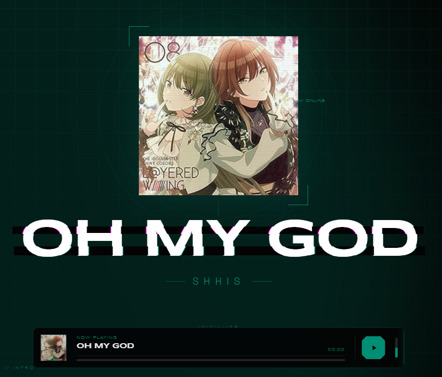
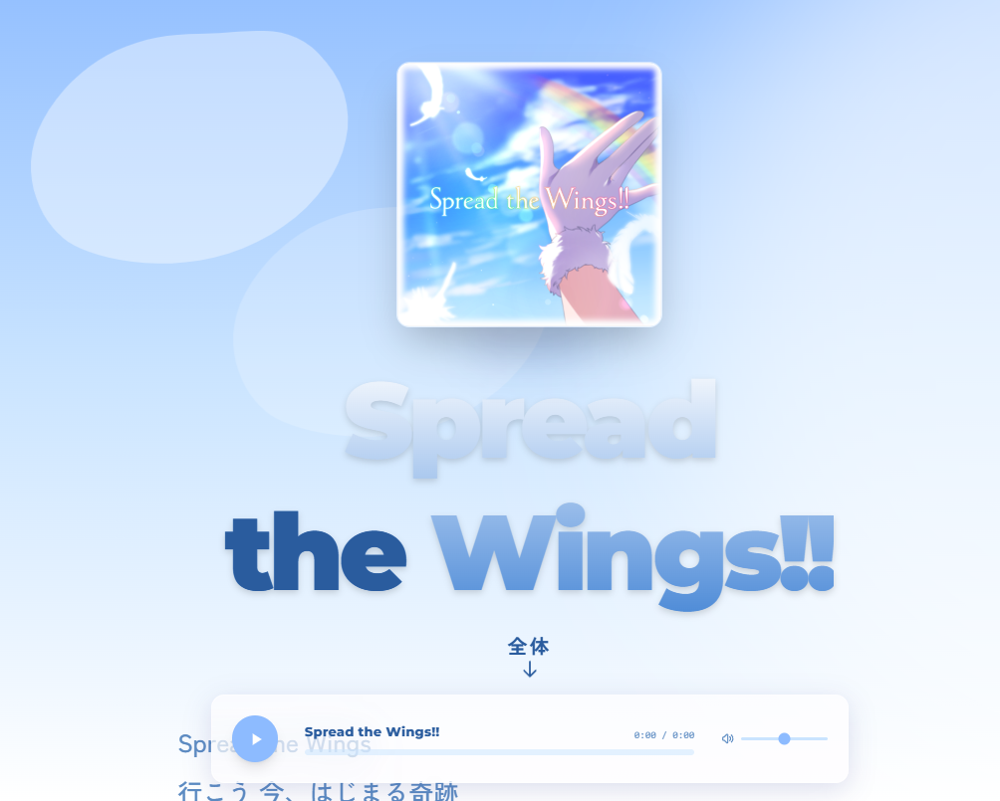
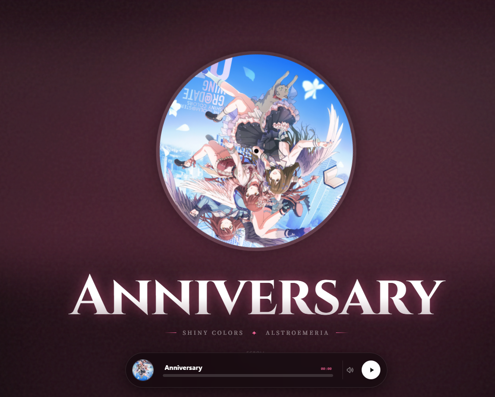

<div align="center">

# 🎵 iDOLM@STER Lyrics Archive

[简体中文](./README_zh.md)

**"One Song, One Style"** — *A high-end, immersive visual storytelling experience.*

[](https://astro.build/)
[](https://tailwindcss.com/)
[](LICENSE)

<br />


*The nostalgic, film-grained aesthetic of "Sunfaded" — a customized experience.*

</div>

---

## 🌟 One Song, One Style: Visual Gallery

Each track is more than just lyrics; it's a curated digital performance.

| **OH MY GOD** | **Spread the Wings** | **Anniversary** |
| :---: | :---: | :---: |
|  |  |  |
| *City-pop elegance with SHHis's high-fashion aesthetics.* | *The vast, azure sky of 283 Production — pure and hopeful.* | *A grand celebration of milestones with warm, festive palettes.* |

---

## 🤖 The "Sisyphus" Agent Ecosystem

This repository is maintained and evolved through a unique **Multi-Agent Collaboration** system, ensuring every song gets its own "soul".

- 🏛️ **Sisyphus (Orchestrator)**: Manages core architecture and deployment strategies.
- 🎨 **Frontend UI/UX Engineer**: Crafts custom CSS arts and immersive animations for "Custom" layouts.
- 📚 **Librarian**: Researches high-performance WebGL effects and typography optimization.
- ✍️ **Document Writer**: Maintains consistency in storytelling and technical standards.

*Learn more about our workflow in [AGENTS.md](./AGENTS.MD).*

---

## ✨ Feature Highlights

- 🎭 **Immersive Visuals**: Custom layouts (`layoutType`) and theme palettes meticulously crafted for each unit's aesthetic.
- 🎵 **Artistic Audio Player**: A glassmorphic, responsive player that dynamically adapts to the song's visual theme.
- ✨ **Keyword VFX**: Real-time rendering of special effects for evocative lyrics (e.g., "夢", "愛", "光").
- 📜 **Scroll-Driven Storytelling**: Content that breathes and transforms as you scroll, powered by modern CSS and Intersection Observer.
- 🔍 **Instant Discovery**: Ultra-fast, client-side search indexing via **Pagefind** for seamless navigation.
- 📱 **Premium Experience**: Fully responsive design ensuring the "stage" looks perfect on mobile, tablet, and desktop.

---

## 🛠️ Tech Stack

| Technology | Role |
| :--- | :--- |
| **Astro 5** | Static Site Generation & Content Collections |
| **Tailwind CSS 4** | Next-gen utility-first styling engine |
| **Pagefind** | Static search library for lightning-fast results |
| **TypeScript** | Type-safe logic and component development |
| **View Transitions** | Fluid, app-like navigation between pages |

---

## 🚀 Getting Started

<details>
<summary><b>Installation & Development</b></summary>

### Prerequisites
- Node.js (Latest LTS)
- npm, pnpm, or yarn

### Setup
```bash
# Clone the repository
git clone https://github.com/Sallyn0225/imas-lyrics-visualizer.git

# Install dependencies
npm install
```

### Development
```bash
# Start the development server
npm run dev
```

### Build & Search Indexing
Since Pagefind indexes static files, you need to build the project to update the search index:
```bash
# Build the project
npm run build

# Preview the build locally
npm run preview
```
</details>

<details>
<summary><b>Deployment</b></summary>

The project is architected for multi-platform deployment:
- **Vercel**: Optimized via `vercel.json`.
- **Netlify**: Configured via `netlify.toml`.
- **Cloudflare Pages**: High-performance headers via `public/_headers`.
</details>

---

## 📖 Documentation

Explore our guides to understand the project's inner workings:
- [**Contributing Guide**](./docs/CONTRIBUTING.md) — How to add new lyrics and master the data structure.
- [**Agent Collaboration**](./AGENTS.MD) — How Sisyphus and other AI agents maintain the archive's soul.

---

## 📄 License & Disclaimer

This project is an open-source fan creation for educational and appreciation purposes.

**Disclaimer**: *The iDOLM@STER* is a trademark of **BANDAI NAMCO Entertainment Inc.** All musical content and related intellectual property belong to their respective owners.

<div align="center">
  <sub>Built with ❤️ for Producers around the world.</sub>
</div>
